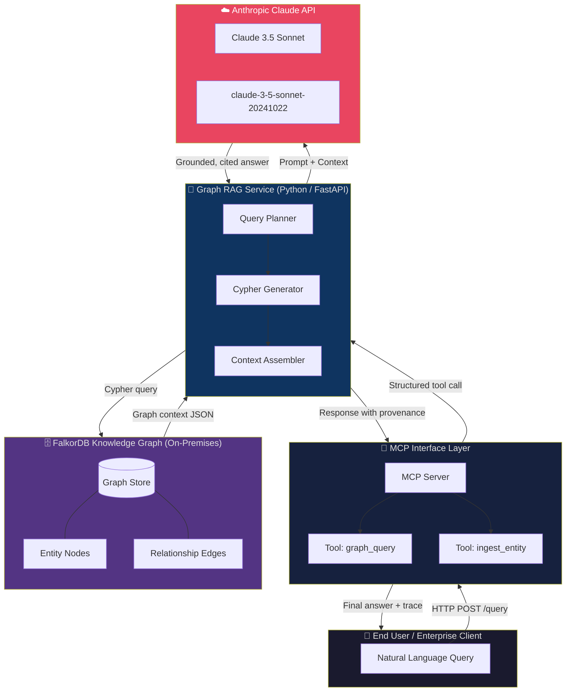

# 🧠 FalkorDB × Claude — Sovereign Graph RAG Architecture

> **A production-ready, GDPR-compliant blueprint for European enterprises building Agentic AI on top of a Knowledge Graph — without sending sensitive data to external vector stores.**

[](LICENSE)
[](https://www.python.org/)
[](https://www.falkordb.com/)
[](https://www.anthropic.com/)
[](https://modelcontextprotocol.io/)
[](https://docs.docker.com/compose/)

---

## 🎯 The Problem This Solves

European enterprises face a fundamental tension: **world-class AI capabilities vs. data sovereignty mandates**.

Standard RAG implementations route sensitive documents through third-party embedding APIs and cloud-hosted vector stores — creating GDPR compliance nightmares, opaque retrieval mechanisms, and no audit trail.

This repository provides a **fully containerised, air-gap capable** alternative:

| Concern | Traditional Vector RAG | **This Architecture** |
|---|---|---|
| **Data residency** | Cloud-hosted vector store | ✅ FalkorDB runs on-premises / in your VPC |
| **Explainability** | Black-box cosine similarity | ✅ Full Cypher query provenance |
| **Hallucination risk** | High (embedding drift) | ✅ Grounded in explicit entity relationships |
| **Relationship modelling** | Flat document chunks | ✅ Rich multi-hop graph traversal |
| **MCP integration** | Manual plumbing | ✅ MCP server hooks pre-wired |
| **GDPR audit trail** | None | ✅ Every retrieval is a logged Cypher query |

---

## 🏗️ Architecture



---

## 🇪🇺 Sovereign AI: Why This Matters for European Enterprises

The EU AI Act and GDPR together create strict obligations around:

- **Data minimisation** — only relevant context reaches the LLM
- **Right to explanation** — every AI decision must be traceable
- **Data residency** — personal data must not leave designated jurisdictions
- **Third-party risk** — external embedding providers are data processors requiring DPAs

This stack satisfies all four. FalkorDB runs **entirely within your infrastructure**. The only external call is to the Claude API with a **minimal, structured context payload** — never raw documents.

---

## ⚡ Quickstart

### Prerequisites

- [Docker Desktop](https://www.docker.com/products/docker-desktop/) ≥ 25.x
- [Docker Compose](https://docs.docker.com/compose/) v2
- An [Anthropic API key](https://console.anthropic.com/)

### 1. Clone the repository

```bash
git clone https://github.com/YOUR_ORG/FalkorDB-Claude-RAG-Architecture.git
cd FalkorDB-Claude-RAG-Architecture
```

### 2. Configure environment variables

```bash
cp .env.example .env
# Edit .env and add your ANTHROPIC_API_KEY
```

```env
ANTHROPIC_API_KEY=sk-ant-...
FALKORDB_HOST=falkordb
FALKORDB_PORT=6379
LOG_LEVEL=INFO
```

### 3. Launch the full stack

```bash
docker compose up --build
```

This starts:
- **FalkorDB** on `localhost:6379` (graph store) + `localhost:3000` (RedisInsight dashboard)
- **graph-rag-service** on `localhost:8000` (FastAPI application)

### 4. Ingest sample data & run a query

```bash
# Ingest a sample relationship into the knowledge graph
curl -X POST http://localhost:8000/ingest \
  -H "Content-Type: application/json" \
  -d '{"subject": "ACME_Corp", "relation": "OWNS", "object": "CustomerPII_Dataset_EU"}'

# Run a natural language query backed by the graph
curl -X POST http://localhost:8000/query \
  -H "Content-Type: application/json" \
  -d '{"question": "Which entities own EU personal data?"}'
```

---
[](https://deepwiki.com/WizardofTryout/FalkorDB-Claude-RAG-Architecture)

## 📁 Repository Structure

```
FalkorDB-Claude-RAG-Architecture/
├── src/
│   ├── graph_rag_agent.py        # Core Graph RAG proof-of-concept
│   ├── api.py                    # FastAPI application layer
│   ├── graph_client.py           # FalkorDB client wrapper
│   ├── prompt_builder.py         # Structured prompt assembly
│   └── mcp_server.py             # MCP server bindings (WIP)
├── docker/
│   ├── Dockerfile                # Multi-stage Python application image
│   └── falkordb/
│       └── init.cypher           # Graph schema initialisation
├── docs/
│   ├── architecture.md           # Detailed architecture decision records
│   ├── gdpr-compliance.md        # GDPR compliance mapping
│   ├── mcp-integration.md        # MCP server implementation guide
│   └── cypher-examples.md        # Example Cypher queries
├── tests/
│   ├── test_graph_client.py
│   ├── test_rag_agent.py
│   └── conftest.py
├── .env.example
├── docker-compose.yml
├── requirements.txt
└── README.md
```

---

## 🔌 Model Context Protocol (MCP) Integration

This repository is architected as a **future MCP server**. The `src/mcp_server.py` module (WIP) will expose the following tools to Claude:

| MCP Tool | Description |
|---|---|
| `graph_query(cypher)` | Execute a read-only Cypher query and return structured results |
| `ingest_entity(subject, relation, object)` | Add a new relationship triple to the knowledge graph |
| `find_paths(source, target, max_hops)` | Find all paths between two entities |
| `get_entity_context(entity_id)` | Retrieve full neighbourhood context for an entity |

Once the MCP server is complete, Claude will be able to **autonomously query and update the knowledge graph** during an agentic workflow — without any custom API glue code.

---

## 🛡️ Security Considerations

- **No raw documents are sent to Claude** — only structured, Cypher-extracted triples
- FalkorDB is network-isolated within the Docker bridge network
- The API key is injected at runtime via environment variable — never baked into images
- All inter-service communication happens over the internal `rag-network`
- Production deployments should add: mTLS, API gateway rate limiting, and audit log streaming

---

## 🗺️ Roadmap

- [x] Core Graph RAG proof-of-concept
- [x] FalkorDB + FastAPI Docker stack
- [ ] MCP server implementation (`src/mcp_server.py`)
- [ ] Multi-hop reasoning (3+ hop Cypher traversals)
- [ ] Streaming responses via Server-Sent Events
- [ ] LangChain / LlamaIndex adapter layer
- [ ] GDPR audit log exporter (structured JSON → SIEM)
- [ ] Helm chart for Kubernetes deployment

---

## 🤝 Contributing

Contributions are welcome! Please read `CONTRIBUTING.md` and open an issue before submitting a pull request. This project follows the [Contributor Covenant](https://www.contributor-covenant.org/) code of conduct.

---

## 📄 License

MIT License — see [LICENSE](LICENSE) for details.

---

<p align="center">
  Built with ☕ for European enterprise AI teams who refuse to compromise on sovereignty.
</p>
